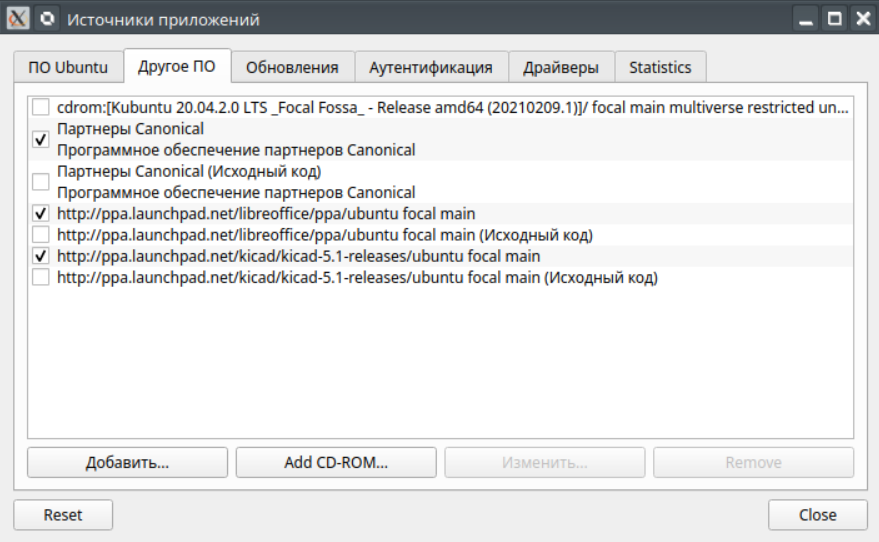
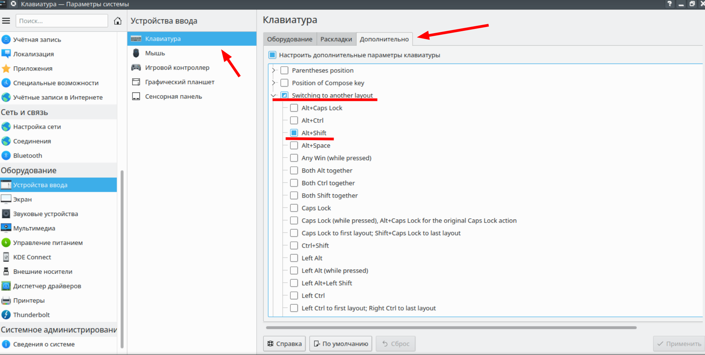

## Настало время прокачать вашу свежеустановленную ОС (Kubuntu)!

### Запускаем Терминал при помощи клавиатурной комбинации Ctrl-Alt-T и вставляем в него при помощи клавиатурной комбинации Ctrl-Shift-V строку. После вставки текста вводим Y и Enter.

### Локализуем ОС:

sudo apt install aspell-ru language-pack-kde-ru language-pack-ru language-pack-ru-base myspell-ru language-pack-gnome-ru-base language-pack-gnome-ru firefox-locale-ru libreoffice-l10n-ru language-pack-gnome-ru-base language-pack-gnome-ru

### Подключение партнёров Ubuntu:

sudo software-properties-qt

### В открывшемся окне установить флажки:

### Настройка раскладки клавиатуры. В Параметрах системы открыть пункт:

### Обновить ОС:

sudo apt list --upgradable -a && sudo apt update && sudo apt full-upgrade

### Устанавливаем необходимые мультимедийные кодеки и шрифты (во время выполнения этой установки браузер лучше закрыть!):

sudo apt update && sudo apt install ubuntu-restricted-extras ttf-dejavu-core fonts-crosextra-carlito fonts-crosextra-caladea

### Появится такое окно:


*В процессе установки программа задаёт пользователю вопросы, на которые нужно отвечать утвердительно (Y/Да), используя TAB и стрелки для перемещения и Enter.*




### Приложения для камеры и звукозаписи:

sudo apt update && sudo apt install guvcview gnome-sound-recorder gnome-clocks

### Gifex - GIF запись с экрана в Linux:

sudo snap install gifex

### Программа для загрузки видео с таких сайтов (YouTube etc.):

sudo snap install video-downloader

### TeamViewer для Linux для удалённого доступа и поддержки через Интернет:

http://www.teamviewer.com/ru/download/linux.aspx

### Chrome - бесплатный браузер от Google:

https://www.google.ru/chrome/

### Gimp - полноценный редактор графики:

sudo apt update && sudo apt install gimp gimp-gmic gimp-gap gimp-data-extras gimp-dcraw abr2gbr

### Pinta - простая рисовалка в духе Paint.net:

sudo snap install pinta

### Karbon - простой редактор векторной графики:

sudo apt update && sudo apt install karbon

### Клавиатурный тернажер:

sudo apt update && sudo apt install gtypist

*Запуск с русской раскладкой: *

gtypist ru.typ

### Программа видеоконференций ZOOM:

sudo snap install zoom-client

### Telegram - отличный мессенжер!

sudo snap install telegram-desktop

### Читалка формата DJVI:

sudo apt update && sudo apt install djview4

### Набор архиваторов:

sudo apt update && sudo apt install rar unrar p7zip-full arj

### Простые игры:

sudo apt install gnome-chess quadrapassel
knetwalk

### FreeCAD - 2D/3D решение для любителей и инженеров с начальной поддержкой формата dwg (Autocad):

sudo snap install freecad

### Cura - слайсер для 3D принтера:

sudo snap install cura-slicer

### Leocad - проектрирование Lego:

sudo snap install leocad --classic

### Kalzium - таблица Менделеева:

sudo snap install kalzium --classic

### Gcompris - набор развивающих игр:

sudo snap install gcompris --classic

### Arduino для Ubuntu 14/16/18 (32/64 bit):

cd ~ ; mkdir Programs ; cd Programs && wget https://downloads.arduino.cc/arduino-1.8.16-linux64.tar.xz && tar -xvf arduino-1.8.16-linux64.tar.xz && cd arduino-1.8.16 && sudo ./install.sh

*Чтобы программный код загружался в контроллер, нужно добавить текущего пользователя в группы dialout и tty:*

sudo gpasswd -a ${USER} tty && sudo gpasswd -a ${USER} dialout && sudo gpasswd -a ${USER} plugdev

*Установить необходимое для работы с платами компоненты можно командой:*

sudo apt-get install gcc-avr binutils-avr gdb-avr avr-libc avrdude

### Поддержка Java (необходима для некоторых программ. Во время установки браузер лучше закрыть!):

sudo apt update && sudo apt install default-jre default-jdk

### Скриншотер (их много, но этот один из лучших):

sudo apt update && sudo apt install flameshot

### Инструменты разработчика C++:

sudo apt update && sudo apt install build-essential git ghex gdb lldb

### Для создания схем и разводки печатных плат KiCAD EDA:

sudo add-apt-repository --yes ppa:kicad/kicad-5.1-releases && sudo apt update && sudo apt install --install-recommends kicad kicad-demos kicad-locale-ru

Подробнее о дополнениях к KiCAD

https://progmatikus.livejournal.com/323678.html

### FlatCam - позволяет перенести ваши проекты на фрезерный станок с ЧПУ:

sudo apt install python3-pip python3-tk && pip install flatcam

*запускать так:*

/home/user/.local/bin/flatcam

*или так:*

flatcam

### Scratch Desktop 3.6 for Ubuntu Linux:

sudo snap install scratux

### Fritzing - программный комплекс начального уровня для проектирования электронных устройств. Полезен в учебных целях:

sudo apt update && sudo apt install fritzing fritzing-data fritzing-parts

### Geany - это мощный, стабильный и легкий текстовый редактор для программистов:

sudo apt update && sudo apt install geany geany-plugins

### Dia - приложение для рисования структурированных диаграмм

sudo apt update && sudo apt install dia

### Tilix - тайловый (многооконный) терминал:

sudo add-apt-repository ppa:webupd8team/terminix && sudo apt-get update && sudo apt install tilix

### Micro - свободный текстовый редактор для консоли:

cd ~ ; cd Загрузки && wget https://github.com/zyedidia/micro/releases/download/v2.0.10/micro-2.0.10-amd64.deb && sudo apt update && sudo dpkg -i micro-2.0.10-amd64.deb && sudo apt update

### Набор необходимых и полезных утилит:

sudo apt update && sudo apt install mc gdebi htop tree mesa-utils sl lm-sensors neofetch winbind wget curl ppa-purge inxi recoll net-tools xclip xsel arp-scan aria2

### SimulIDE - простой и бесплатный симулятор электрических цепей:

cd ~ ; wget https://launchpad.net/simulide/0.4.15/0.4.15-stable/+download/simulide_0.4.15-SR7.AppImage && chmod a+x simulide_0.4.15-SR7.AppImage

### OpenShot - простой в управлении и мощный по возможностям видеоредактор:

sudo add-apt-repository ppa:openshot.developers/ppa && sudo apt update && sudo apt install openshot-qt

### Audacity - простой в управлении и мощный по возможностям аудиоредактор:

sudo add-apt-repository ppa:ubuntuhandbook1/audacity && sudo apt update && sudo apt install audacity

### OBS Studio - бесплатное программное обеспечение с открытым исходным кодом для записи видео и потокового вещания:

sudo add-apt-repository ppa:obsproject/obs-studio && sudo apt update && sudo apt install ffmpeg obs-studio

### Установка новой версии LibreOffice:

sudo add-apt-repository ppa:libreoffice/ppa && sudo apt update && sudo apt dist-upgrade

### Установка дополнительных тем для LibreOffice:

sudo apt update && sudo apt install libreoffice-style-breeze libreoffice-style-tango libreoffice-style-sifr

### После того, как всё успешно установилось, перезагружаем ОС командой reboot в терминале!

### Если вам недостаточно имеющихся приложений, то посетите эту страницу для поиска и установки нужной вам программы:

https://progmatikus.livejournal.com/55550.html

### Так же много приложений можно найти сдесь:

https://snapcraft.io/store

### Информация об оборудовании с помощью Inxi:

*запуск этой программы в Терминале:*

inxi -Fs