**Установка Linux Lite подробно описана тут:**

https://web-shpargalka.ru/linux-lite-sistemnye-trebovanija.php

## Настраиваем Linux Lite v 5.6

### Открываем окно настроек:

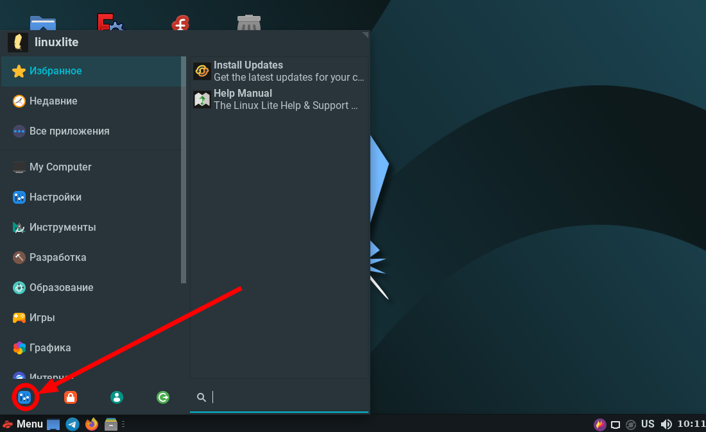

#### Отключаем скринсервер и засыпание монитора

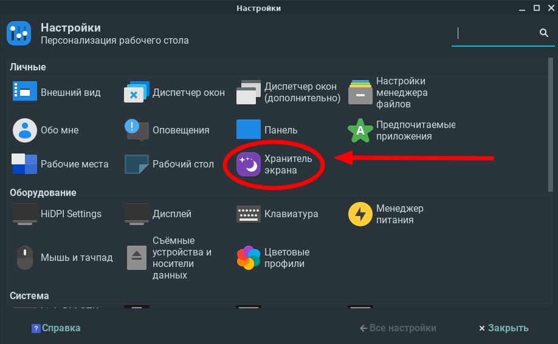

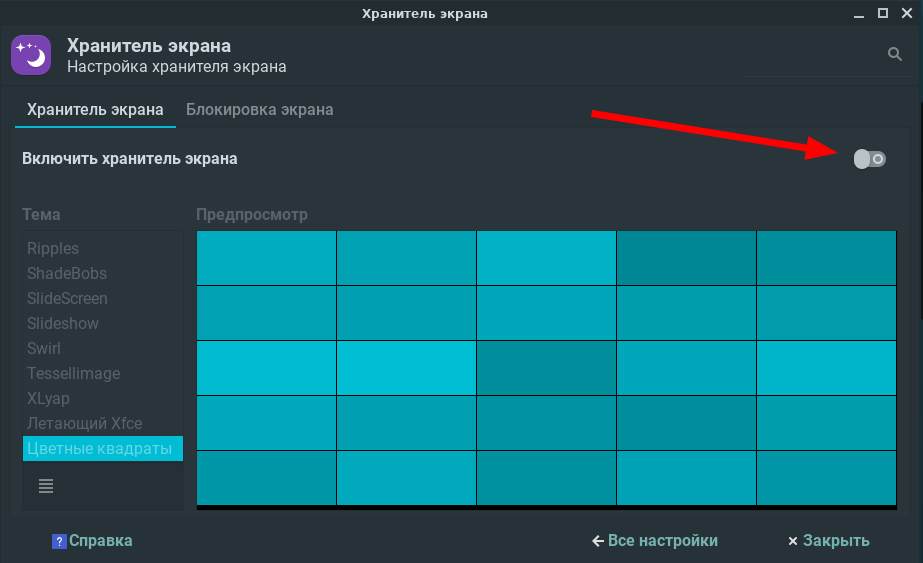

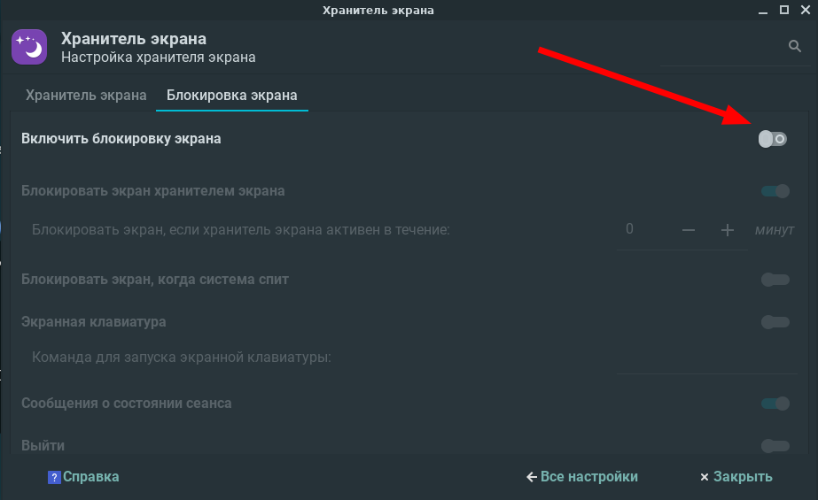

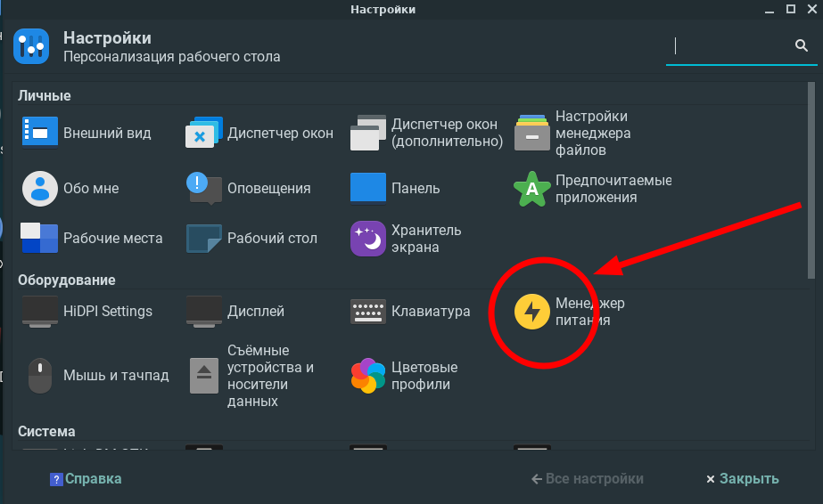

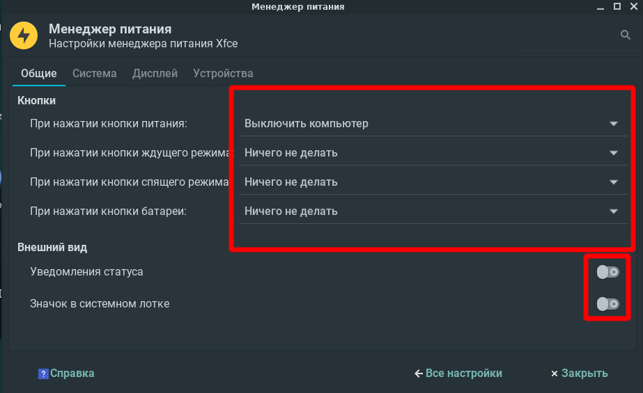

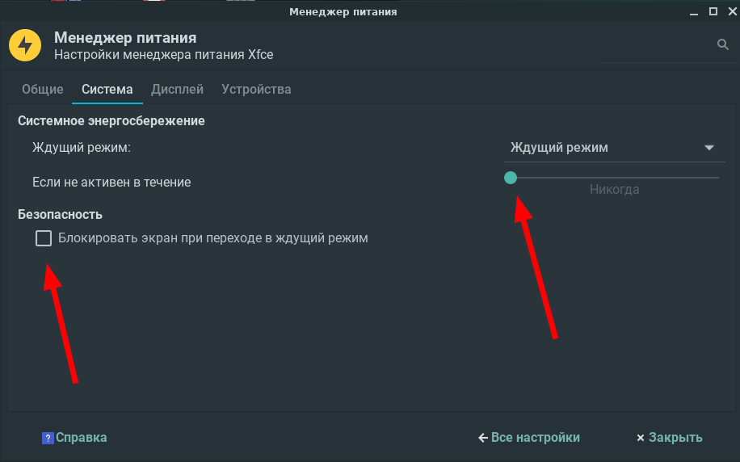

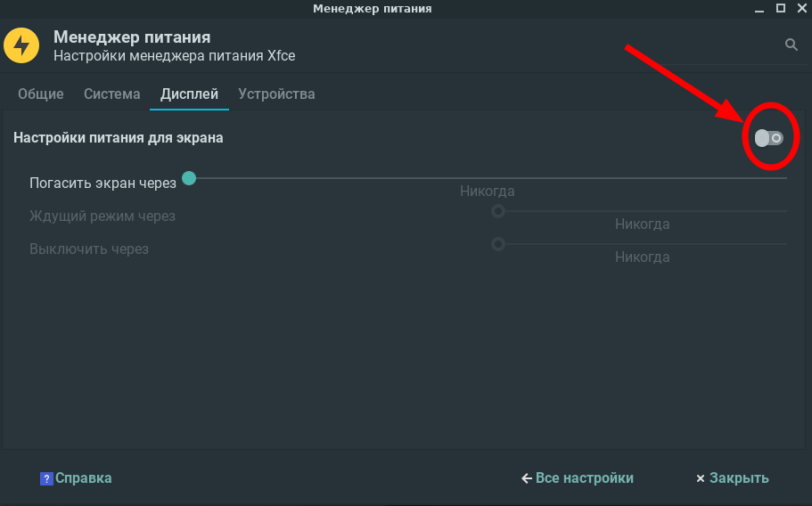

#### Локализуем всю систему:

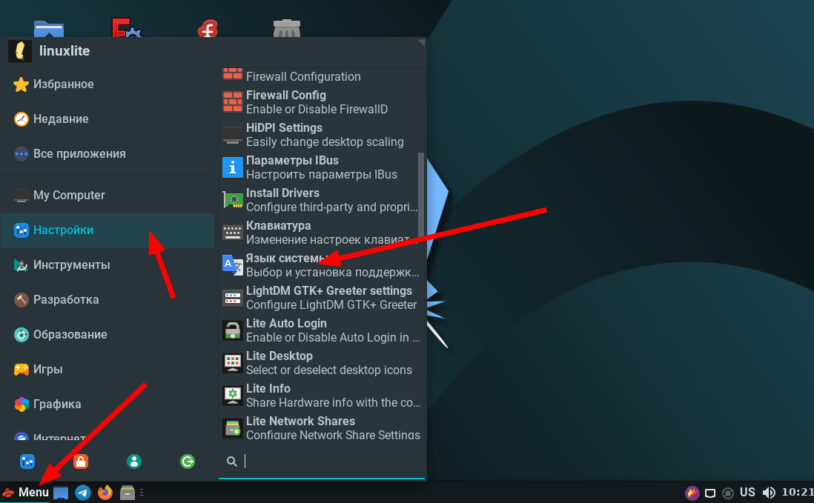

**Программа попросит вас загрузить обновления языков, нужно согласиться**

#### Настраиваем раскладку клавиатуры:

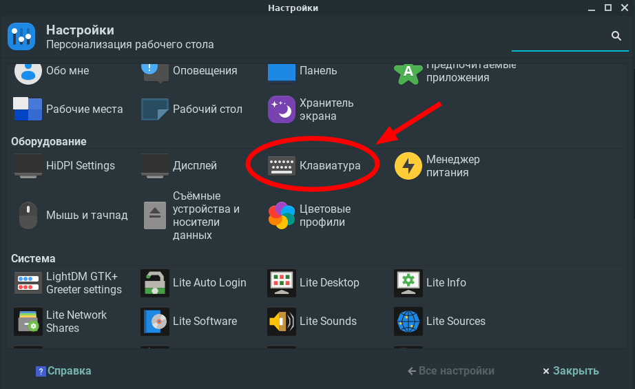

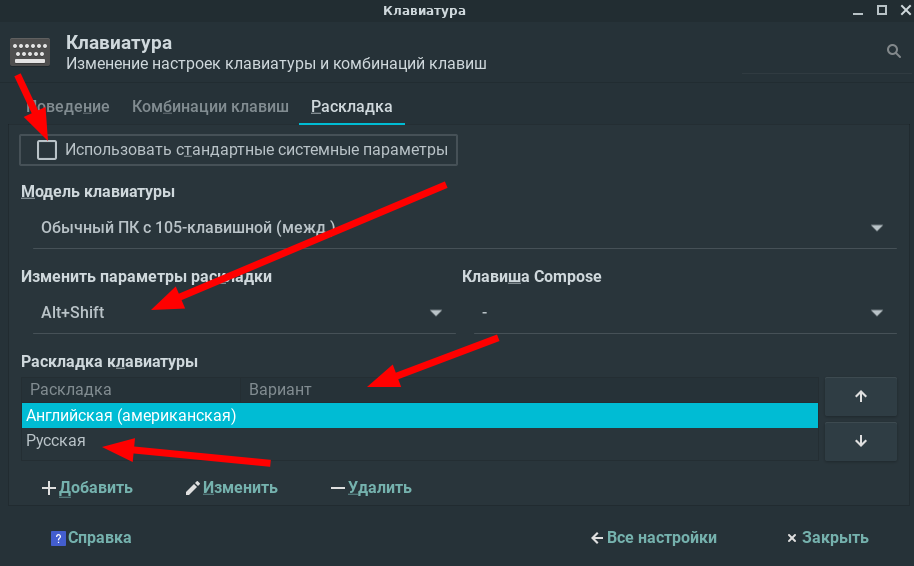

#### Настройка нижней панели:

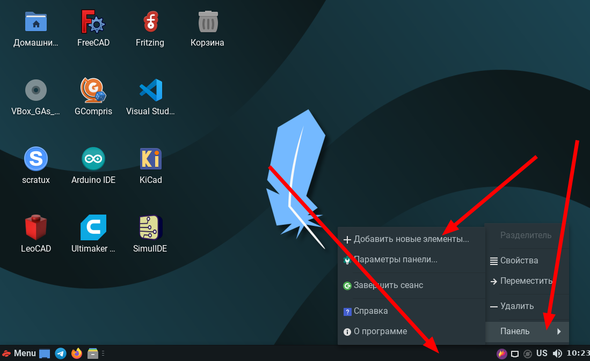

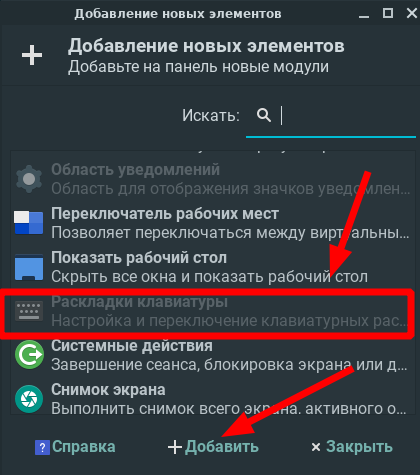

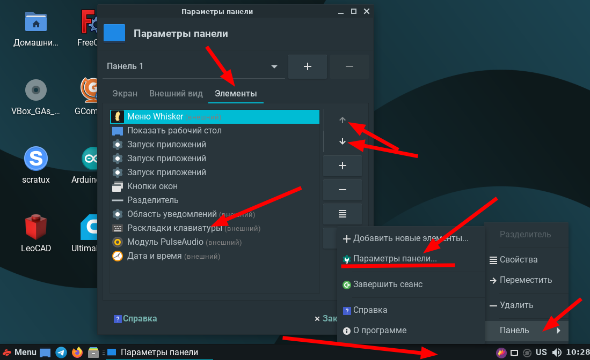

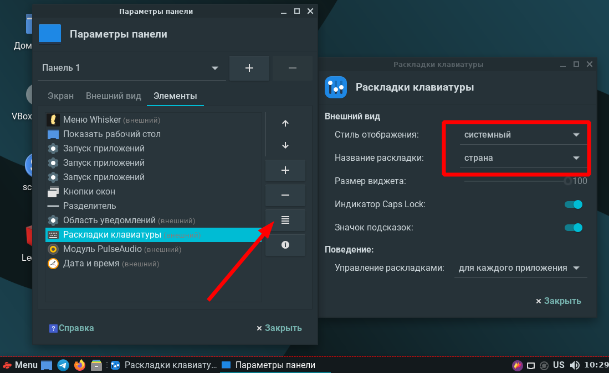

### Настройка источников приложений:

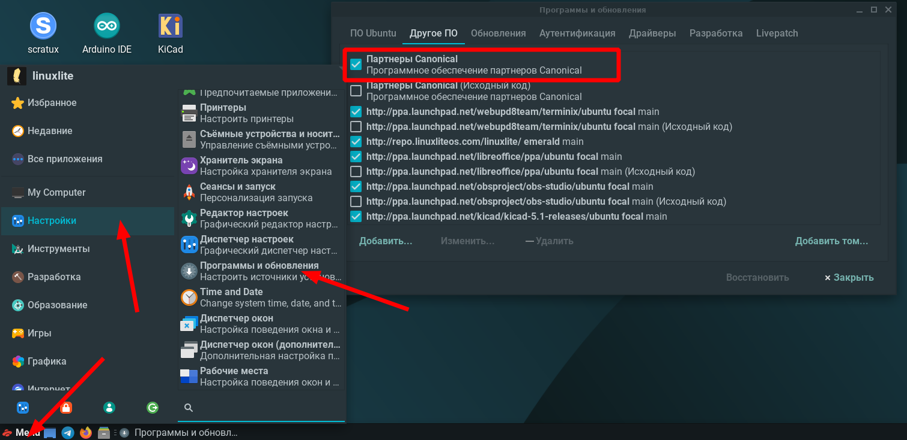

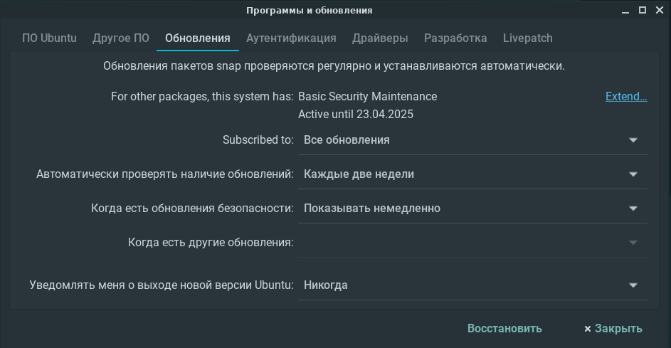

**Запускаем Терминал при помощи клавиатурной комбинации Ctrl-Alt-T и вставляем в него при помощи клавиатурной комбинации Ctrl-Shift-V строку. **

*После вставки текста вводим Y и нажимаем Enter:*

`sudo apt list --upgradable -a && sudo apt update && sudo apt full-upgrade -y && reboot`

*Эта команда обновит и перезагрузит ОС.*

**Установить ядро 5.11**

`sudo apt install --install-recommends linux-generic-hwe-20.04`

### Установить приложения (открыть ссылку):

https://github.com/rurewa/Education/blob/main/UbuntuPumping/SoftInstall.md