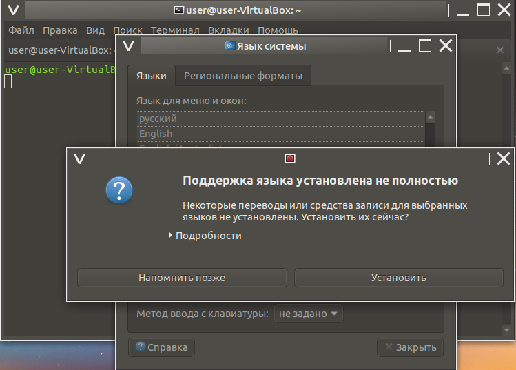
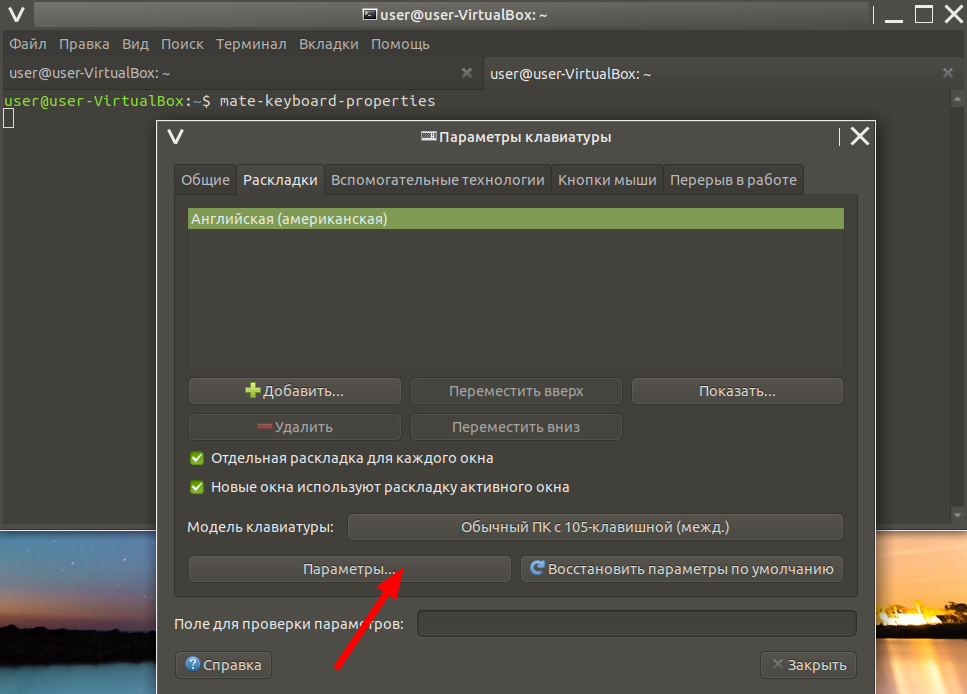
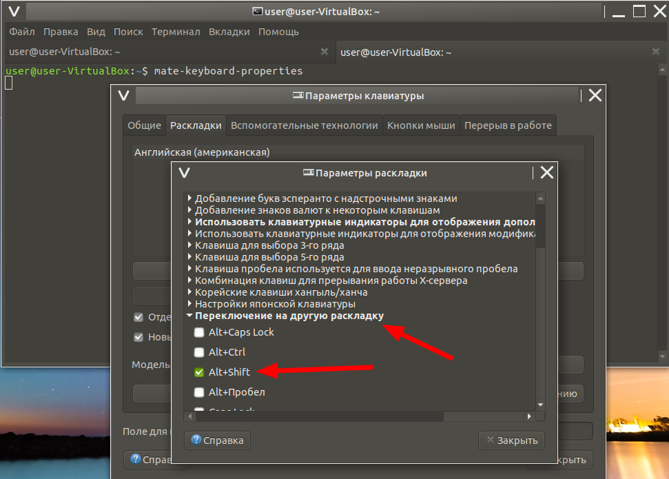
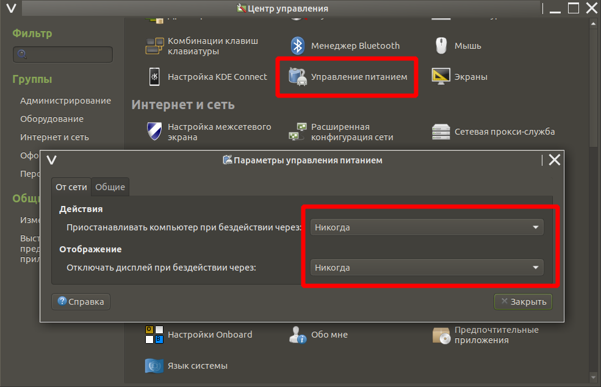
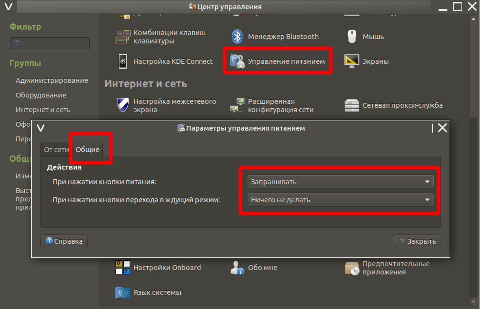
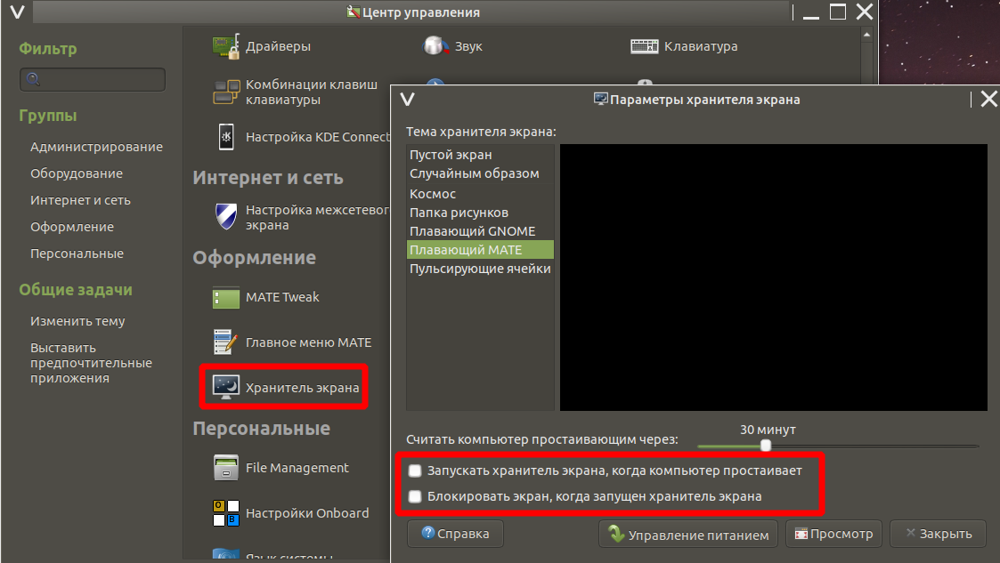
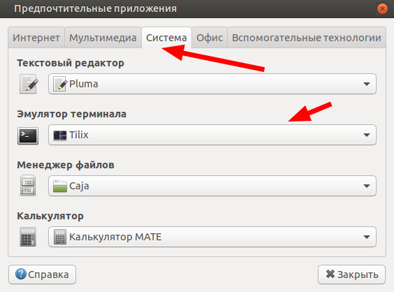

## Прокачка Ubuntu Mate 20.04/64 bit

### Запускаем Терминал при помощи клавиатурной комбинации Ctrl-Alt-T и вставляем в него при помощи клавиатурной комбинации Ctrl-Shift-V строку. 

### Подключаем партнёров Canonical (запустить команду в Терминале):

`sudo software-properties`

`sudo apt list --upgradable -a && sudo apt update && sudo apt full-upgrade -y && reboot`

*Эта команда обновит и перезагрузит ОС.*

### Дополнительная локализация приложений (запустить команду в Терминале):

`gnome-language-selector`

*В открывшемся окне нажмите "Установить"*

### Установить переключение клавиатуры на другой язык (запустить команду в Терминале):

`mate-keyboard-properties`

*В открывшемся окне выполните это:*

 

### Отключить засыпание компьютера:

### Отключить скринсервер

### Установить приложения (открыть ссылку):

https://github.com/rurewa/Education/blob/main/UbuntuPumping/SoftInstall.md

### Информация об оборудовании с помощью Inxi:

*запуск этой программы в Терминале:*

`inxi -Fs`

### Изменить терминал по умолчанию на  Tilix:

`mate-default-applications-properties`

*Выбрать Tilix*

### Перезагрузите компьютер.

## Всё готово!
