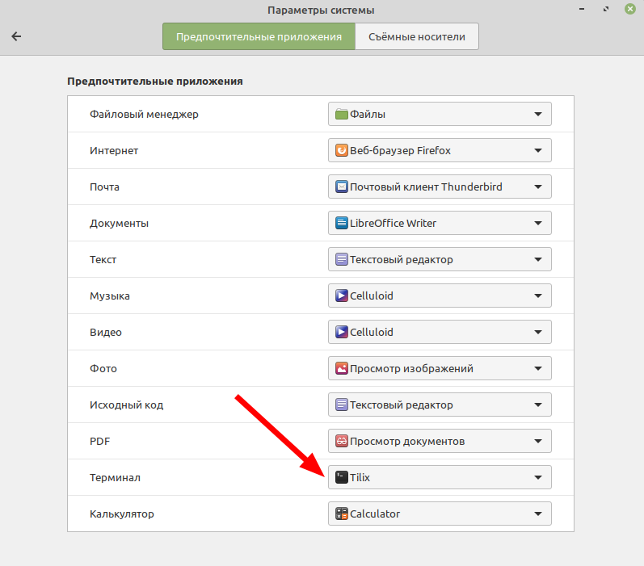

## Прокачка Linux Mint

### Установить переключение клавиатуры на другой язык:

### Отключить засыпание компьютера:

### Отключить скринсервер

### Добавляем источники обновлений:







### Запускаем Терминал при помощи клавиатурной комбинации Ctrl-Alt-T и вставляем в него при помощи клавиатурной комбинации Ctrl-Shift-V строку. 

*После вставки текста вводим Y и нажимаем Enter:*

`sudo apt list --upgradable -a && sudo apt update && sudo apt full-upgrade -y && reboot`

*Эта команда обновит и перезагрузит ОС.*

### Включаем поддержку Snap:

`sudo rm /etc/apt/preferences.d/nosnap.pref && sudo apt update && sudo apt install -y snapd`

### Установить приложения (открыть ссылку):

https://github.com/rurewa/Education/blob/main/UbuntuPumping/SoftInstall.md

*После установки всех приложений выполните унструкции ниже*

### Установка терминала Tilix по умолчанию:

### Информация об оборудовании с помощью Inxi:

*запуск этой программы в Терминале:*

`inxi -Fs`

### Перезагрузите компьютер.

## Всё готово!