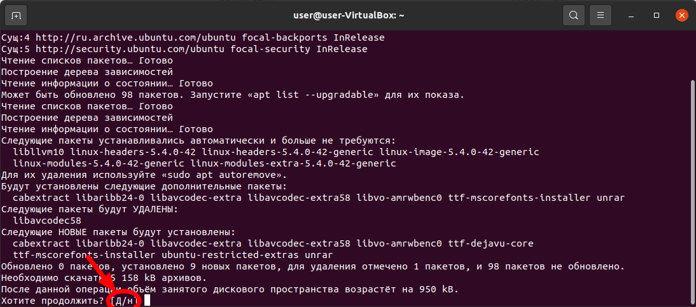
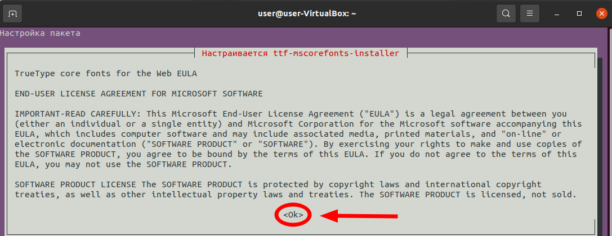
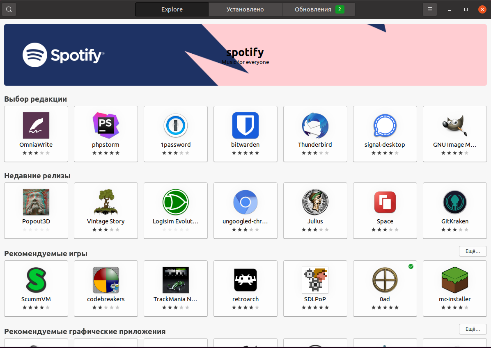

## Прокачка дистрибутивов на базе Ubuntu 20.04 (64 bit)

**Данный список ориентирован на нужды учебных заведений дополнительного образования по дисциплине "Робототехника"**

**Внимание! На данной странице присутствуют длинные наборы команд, которые в одну строку никак не умещаются. Выделяйте мышью всю строку команд, даже если она переходит на новую строку!**

### Мультимедиа

#### Устанановка необходимых мультимедийных кодеков и шрифтов (во время выполнения этой установки браузер лучше закрыть!)

```
sudo apt update && sudo apt install -y ubuntu-restricted-extras ttf-dejavu-core fonts-crosextra-carlito
```

*Начнётся установка:*



*В процессе установки (Если у вас не LinuxLite и Mint) программа задаёт пользователю вопросы, на которые нужно отвечать утвердительно (Y/Да), используя TAB и стрелки для перемещения и Enter.*




### Настройки ОС и окружения Рабочего стола

#### Поддержка snap и flatpack в Центре Приложений:

```
sudo apt update && sudo apt install -y flatpak snap gnome-software gnome-software-plugin-snap gnome-software-plugin-flatpak
```

#### Подключение репозиториев для работы с flatpack:

```
sudo flatpak remote-add --if-not-exists flathub https://flathub.org/repo/flathub.flatpakrepo
```

#### Приложения для камеры и звукозаписи:

```
sudo apt update && sudo apt install -y guvcview gnome-sound-recorder gnome-clocks
```

#### Gifex - GIF запись с экрана в Linux

```
sudo snap install gifex
```

#### Программа для загрузки видео с сайтов (YouTube etc.):

```
sudo snap install video-downloader
```

#### Audacity - простой в управлении и мощный по возможностям аудиоредактор:

```
sudo add-apt-repository ppa:ubuntuhandbook1/audacity -y && sudo apt update && sudo apt install -y audacity
```

#### OBS Studio - бесплатное программное обеспечение с открытым исходным кодом для записи видео и потокового вещания:

```
sudo add-apt-repository ppa:obsproject/obs-studio -y  && sudo apt update && sudo apt install -y ffmpeg obs-studio
```

#### Kdenlive - простой в управлении и мощный по возможностям видеоредактор:

```
sudo add-apt-repository ppa:kdenlive/kdenlive-stable -y && sudo apt-get update && sudo apt install -y kdenlive
```

### Интернет

#### TeamViewer для Linux для удалённого доступа и поддержки через Интернет:

https://www.teamviewer.com/en/download/linux/

#### Chrome - бесплатный браузер от Google:

https://www.google.ru/chrome/

#### Программа видеоконференций ZOOM:

```
sudo flatpak install -y flathub us.zoom.Zoom
```

#### Telegram - отличный мессенжер!

```
flatpak install -y flathub org.telegram.desktop
```

### Графика, 3D печать и дизайн

#### FreeCAD - 2D/3D решение для любителей и инженеров с начальной поддержкой формата dwg (Autocad)

```
sudo flatpak install -y flathub org.freecadweb.FreeCAD
```

**или из apt**

```
sudo add-apt-repository ppa:freecad-maintainers/freecad-stable && sudo apt update && sudo apt install freecad
```

#### Cura - слайсер для 3D принтера:

```
sudo snap install cura-slicer
```

#### Leocad - проектрирование Lego:

```
sudo snap install leocad --classic
```

#### Gimp - полноценный редактор графики:

```
sudo apt update && sudo apt install -y gimp gimp-gmic gimp-gap gimp-data-extras gimp-dcraw abr2gbr
```

#### Pinta - простая рисовалка в духе Paint.net:

```
sudo snap install pinta
```

#### Karbon - простой редактор векторной графики:

```
sudo apt update && sudo apt install -y karbon
```

#### Скриншотер (их много, но этот один из лучших):

```
sudo apt update && sudo apt install -y flameshot
```

### Обучение

#### Клавиатурный тернажер для обучения методу "слепой печати":

```
sudo apt update && sudo apt install -y gtypist
```

*Запуск с русской раскладкой: *

```
gtypist ru.typ
```

#### Kalzium - таблица Менделеева:

```
sudo snap install kalzium --classic
```

#### Gcompris - набор развивающих игр:

```
sudo snap install gcompris --classic
```

### Офис

#### Читалка формата DJVI:

```
sudo apt update && sudo apt install -y djview4
```

#### Установка новой версии LibreOffice:

```
sudo add-apt-repository ppa:libreoffice/ppa -y && sudo apt update && sudo apt dist-upgrade -y
```

#### Установка дополнительных тем для LibreOffice:

```
sudo apt update && sudo apt install -y libreoffice-style-breeze libreoffice-style-tango libreoffice-style-sifr
```

### Утилиты

#### Набор архиваторов:

```
sudo apt update && sudo apt install -y rar unrar p7zip-full arj
```

#### Поддержка Java (необходима для некоторых программ. Во время установки браузер лучше закрыть!):

```
sudo apt update && sudo apt install -y default-jre default-jdk
```

### Набор необходимых и полезных утилит:

```
sudo apt update && sudo apt install -y mc gdebi htop tree mesa-utils sl lm-sensors neofetch winbind wget curl ppa-purge inxi recoll net-tools xclip xsel arp-scan aria2
```

### Простые развивающие игры

```
sudo apt install -y gnome-chess quadrapassel knetwalk aisleriot knavalbattle bovo fltk1.3-games chromium-bsu
```

### Разработка

#### Поддержка Python 3:

```
sudo apt install -y python3-pip python3-distutils python3-tk python3-pydrive
```

#### Arduino для Ubuntu 14/16/18 (32/64 bit):

```
cd ~ ; mkdir Programs ; cd Programs && wget https://downloads.arduino.cc/arduino-1.8.19-linux64.tar.xz && tar -xvf arduino-1.8.19-linux64.tar.xz && cd arduino-1.8.19 && sudo ./install.sh
```

*Чтобы программный код загружался в контроллер, нужно добавить текущего пользователя в группы dialout и tty:*

```
sudo gpasswd -a ${USER} tty && sudo gpasswd -a ${USER} dialout && sudo gpasswd -a ${USER} plugdev
```

*Установить необходимые компоненты для работы с контроллером:*

```
sudo apt install -y gcc-avr binutils-avr gdb-avr avr-libc avrdude
```

#### Processing - быстрый инструментарий для программирования изображений, анимаций и интерфейсов

```
cd ~ ; mkdir Programs ; cd Programs && wget https://github.com/processing/processing/releases/download/processing-0270-3.5.4/processing-3.5.4-linux64.tgz && tar -xvf processing-3.5.4-linux64.tgz && cd processing-3.5.4 && ./install.sh
```

#### Инструменты разработчика C++:

```
sudo apt update && sudo apt install -y build-essential git ghex gdb lldb ascii meld
```

#### Для создания схем и разводки печатных плат KiCAD EDA:

```
sudo add-apt-repository --yes ppa:kicad/kicad-5.1-releases -y && sudo apt update && sudo apt install -y --install-recommends kicad kicad-demos kicad-locale-ru
```

Подробнее о дополнениях к KiCAD

https://progmatikus.livejournal.com/323678.html

#### FlatCam - позволяет перенести ваши проекты на фрезерный станок с ЧПУ:

```
sudo apt install -y python3-pip python3-distutils python3-tk && pip install flatcam
```

*запускать так:*

/home/user/.local/bin/flatcam

*или так:*

```
flatcam
```

#### Scratch Desktop 3 for Ubuntu Linux:

```
sudo snap install scratux
```

#### Fritzing - программный комплекс начального уровня для проектирования электронных устройств. Полезен в учебных целях:

*Если была установлена старая версия, то удаляем её:*

```
sudo apt update && sudo apt purge -y fritzing && sudo apt autoclean && sudo apt autoremove -y
```

*Установка:*

```
cd ~ ; git clone https://github.com/rurewa/Fritzing.git && cp ${HOME}/Fritzing/Fritzing.desktop ${HOME}/Рабочий\ стол/
```

*Обновление (beta):*

```
cd ~ ; cd Fritzing/ && git pull
```

*Подробней об установке и обновлении Fritzing:*

#### Установка игры для программистов Колобот:

```
sudo apt update && sudo apt install -y colobot
```

https://github.com/rurewa/Fritzing

#### Geany - это мощный, стабильный и легкий текстовый редактор для программистов:

```
sudo apt update && sudo apt install -y geany geany-plugins
```

#### Dia - приложение для рисования структурированных диаграмм

```
sudo apt update && sudo apt install -y dia
```

#### Tilix - тайловый (многооконный) терминал:

```
sudo add-apt-repository ppa:webupd8team/terminix -y && sudo apt-get update && sudo apt install -y tilix
```

*Управление окнами в Tilix*

`Ctrl-TAB` - *поочерёдное переключение между окон*

`Ctrl-R/A` - *открыть новое окно справа*

`Ctrl-D` - *открыть новое окно внизу (в Ubuntu и некоторых проихводных придётся переназначить комбинацию на сворачивание всех окон)*

#### Micro - свободный текстовый редактор для консоли:

```
cd ~ ; cd Загрузки && wget https://github.com/zyedidia/micro/releases/download/v2.0.10/micro-2.0.10-amd64.deb && sudo apt update && sudo dpkg -i micro-2.0.10-amd64.deb && sudo apt update
```

#### SimulIDE - простой и бесплатный симулятор электрических цепей:

```
cd ~ ; git clone https://github.com/rurewa/SimuliDE.git && cp ${HOME}/SimuliDE/SimulIDE.desktop ${HOME}/Рабочий\ стол/
```

*Подробней об установке и обновлении SimulIDE*

https://github.com/rurewa/SimuliDE

#### Retext - редактор Markdown-файлов с предпросмотром

```
sudo apt update && sudo apt install -y libjs-mathjax retext
```

#### Color Picker - современный инструмент работы с цветом.

```
sudo flatpak install -y flathub nl.hjdskes.gcolor3
```

#### Visual Studio Code - развитый редактор кода, расширяемый до уровня средней IDE:

*установка из Snap:*

```
sudo snap install code --classic
```

*установка с сайта:*

https://code.visualstudio.com/Download

*если собираетесь использовать PlatformIO, то установить в терминале это:*

```
sudo apt install -y python3-distutils
```

*и это:*

```
curl -fsSL https://raw.githubusercontent.com/platformio/platformio-core/master/scripts/99-platformio-udev.rules | sudo tee /etc/udev/rules.d/99-platformio-udev.rules
```

*Зарядить Visual Studio Code можно по ссылке:*

https://github.com/rurewa/Education/blob/main/UbuntuPumping/VCode.md

### Библиотеки, которые могут понадобиться

```
sudo apt update && sudo apt install -y libpangox-1.0-0 libgtkglext1
```

#### После установки всех приложений желательно перезагрузить компьютер!

### Больше приложений для Ubuntu Linux

#### Список других полезных приложений для Ubuntu

https://github.com/rurewa/Education/blob/main/UbuntuPumping/PostInstallSoft.md

#### В Ubuntu Software:



### Установка драйверов и решение других технических задач

https://github.com/rurewa/Education/blob/main/UbuntuPumping/askubuntu.md
