# Настало время прокачать вашу свежеустановленную ОС!

## Выбираем Программы и обновления

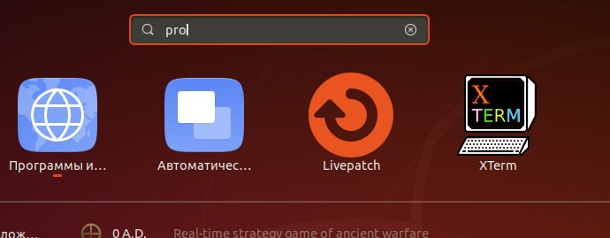

### Устанавливаем флажки Партнёры Canonical

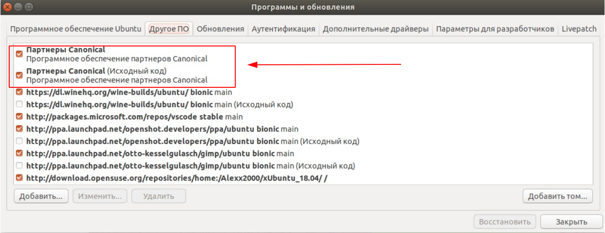

*В соседней вкладке этого же окна уставливаем так, как на картинке:*

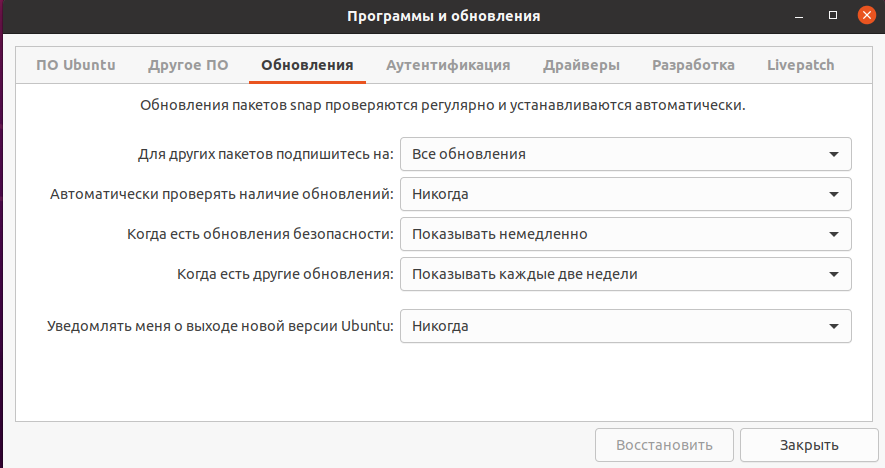

*Запускаем Терминал при помощи клавиатурной комбинации Ctrl-Alt-T и вставляем в него при помощи клавиатурной комбинации Ctrl-Shift-V строку. После вставки текста вводим Y и Enter:*

`sudo apt list --upgradable -a && sudo apt update && sudo apt full-upgrade -y && reboot`

*Эта команда обновит и перезагрузит ОС.*

**Появится такое окно:**

### Некоторые программы не поспевают за изменениями Ubuntu и некорректно попадают в трей. Исправить это можно установкой дополнения по ссылке:

https://extensions.gnome.org/extension/1503/tray-icons/

### Установка русского языка и раскладки

*Запусти настройки языка ОС:*

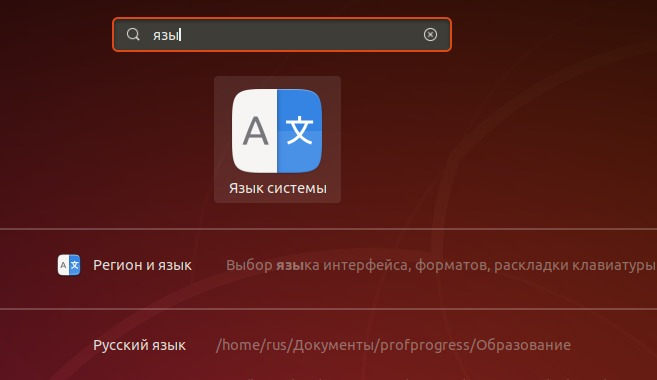

**И обнови язык, соглашаясь на всё!**

### Настрой переключение языков на клавиатуре через Alt-Shift:

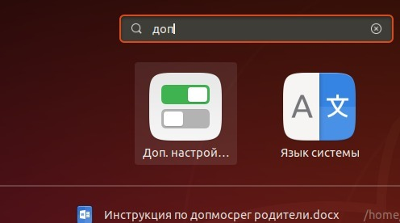

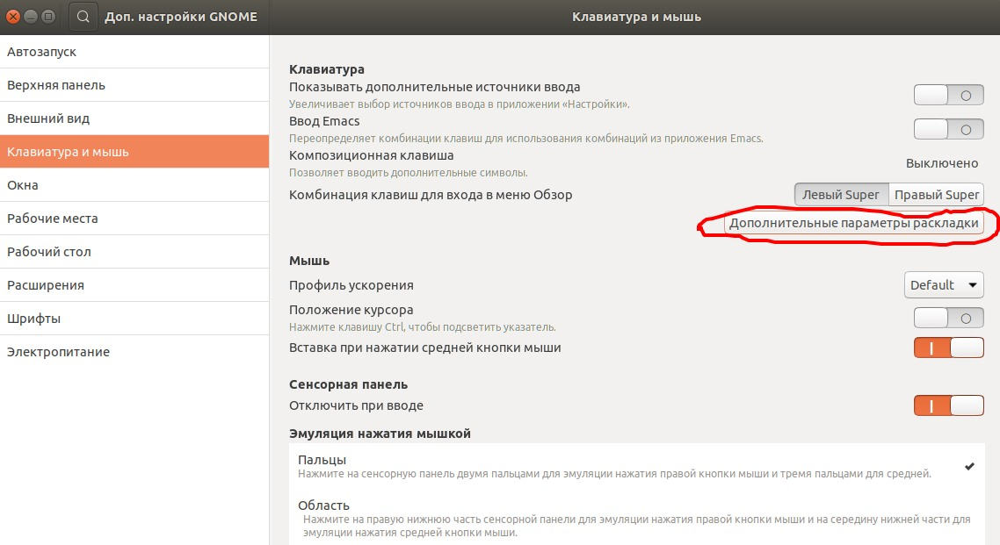

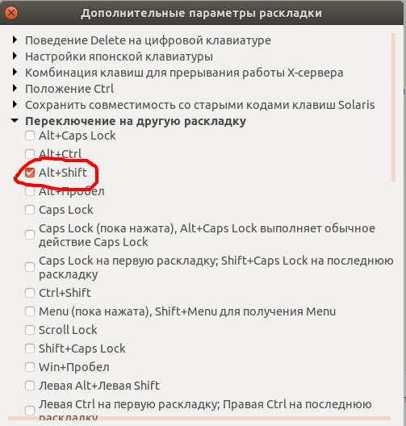

*Не закрывая главное окно дополнительных настроек, выполните:*

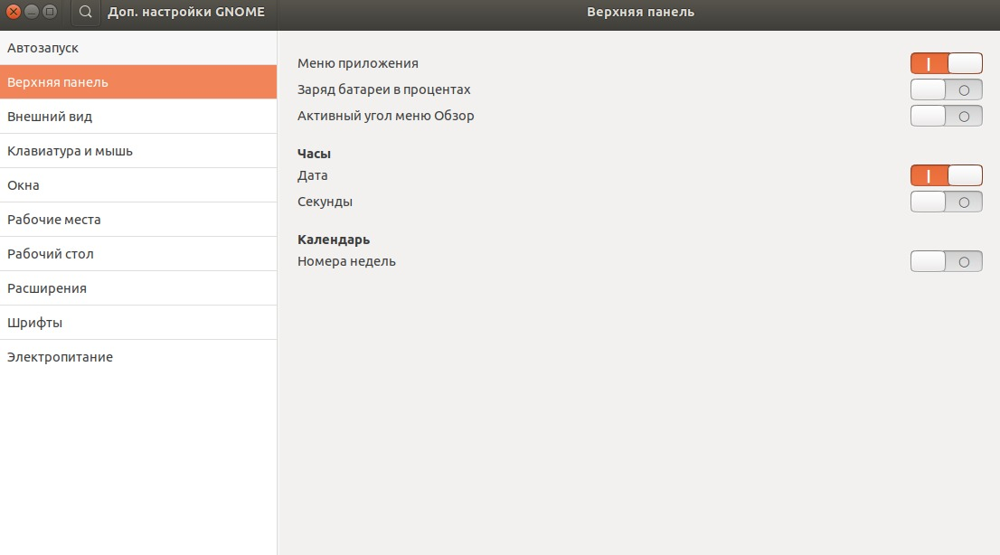

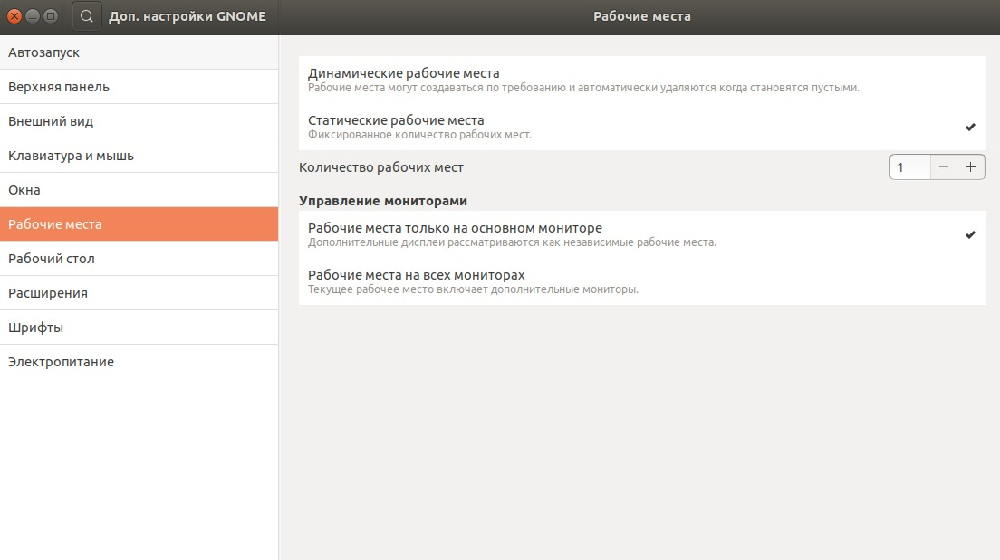

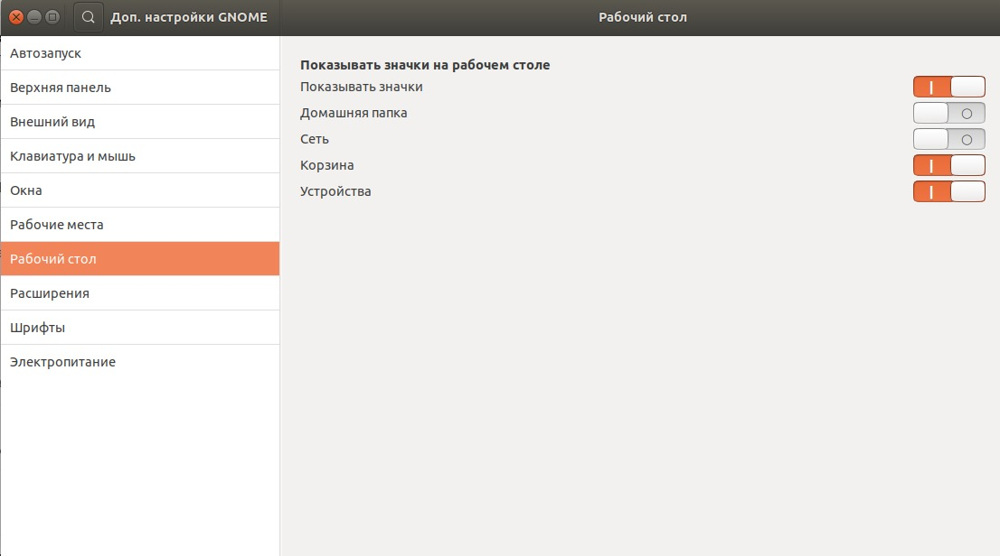

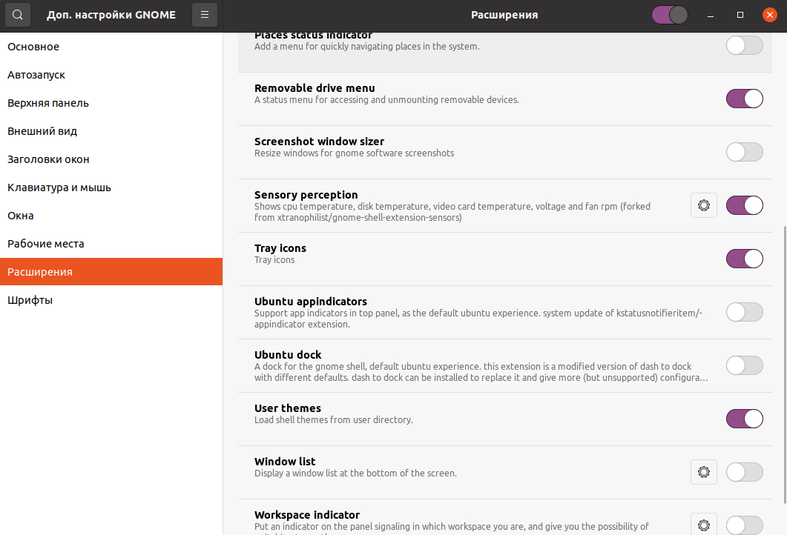

## После того, как всё успешно установилось, перезагружаем ОС командой reboot в терминале!

### Некоторые рекомендации относительно настройки ОС после прокачки:

*Переместить значок Dash вверх/влево (команду выполнить в Терминале):*

`gsettings set org.gnome.shell.extensions.dash-to-dock show-apps-at-top true`

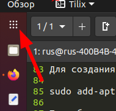

### Приложений может оказаться много, и, чтобы легче ориентироваться в них, сгруппируйте их следующим образом:

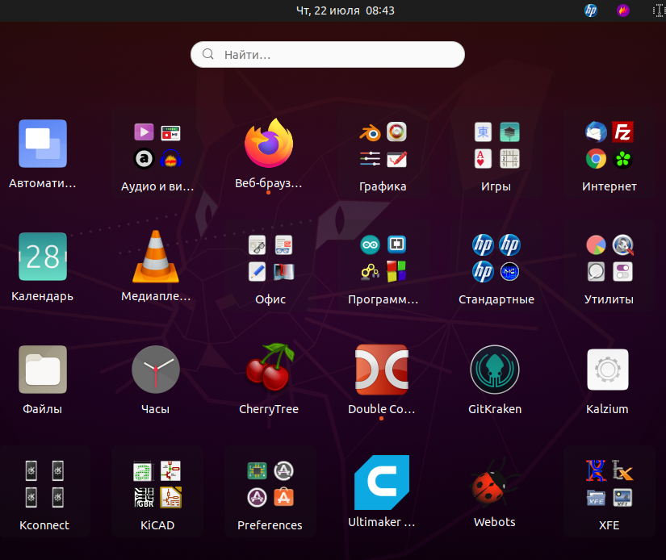

### Чтобы сделать Tilix терминалом по умолчанию:

`gsettings set org.gnome.desktop.default-applications.terminal exec /usr/bin/tilix`

`gsettings set org.gnome.desktop.default-applications.terminal exec-arg "-x"`

### Установить приложения (открыть ссылку):

https://github.com/rurewa/Education/blob/main/UbuntuPumping/SoftInstall.md

*После установки всех приложений выполните унструкции ниже*

### Информация об оборудовании с помощью Inxi:

*запуск этой программы в Терминале:*

`inxi -Fs`

### Для сворачивание всех окон (показать рабочий стол) нужно выполнить Ctrl-Alt-D