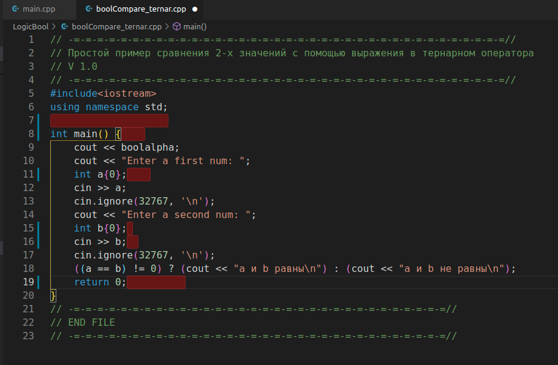
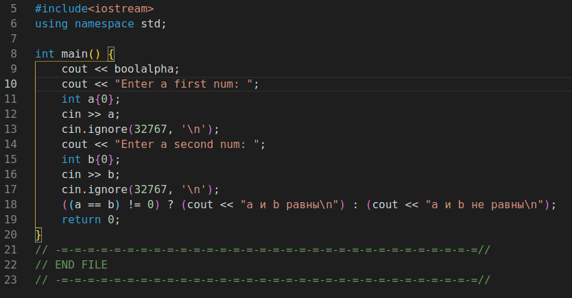

### Прокачиваем Visual Studio Code

#### Установка:

*установка из Snap:*

`sudo apt install python3-distutils ; sudo snap install code --classic`

*установка с сайта:*

https://code.visualstudio.com/Download

*Eсли собираетесь использовать PIO (расширение для Arduino), то выполните в Терминале это:*

`sudo apt install python3-distutils`

*и это:*

curl -fsSL https://raw.githubusercontent.com/platformio/platformio-core/master/scripts/99-platformio-udev.rules | sudo tee /etc/udev/rules.d/99-platformio-udev.rules

*Затем в самом редакторе выполните Ctrl-P и в открывшемся вверху поле вставьте сл.строки по очереди, нажимая Enter:*

*Для Arduino (автоматически устанавливает ещё и c++)*

`ext install platformio.platformio-ide`

*Для подсветки скобок*

`ext install CoenraadS.bracket-pair-colorizer-2`

*Для показа и удаления ненужных пустот в коде*

`ext install shardulm94.trailing-spaces`

*После установки нужно настроить. Нажимаем F1 и появившемся вверху поле вводим shortcuts:*

*далее так:*

**После этого можно удалять пустоты в коде комбинацией Alt-T. Пример:**

