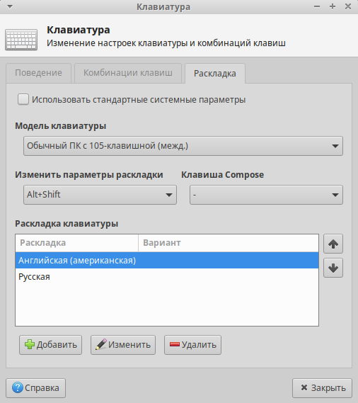

## Прокачка Xubuntu 20.04/64 bit

### Подключаем партнёров Canonical (запустить команду в Терминале):

**Запускаем Терминал при помощи клавиатурной комбинации Ctrl-Alt-T и вставляем в него при помощи клавиатурной комбинации Ctrl-Shift-V строку. **

`sudo software-properties`

**Запускаем Терминал при помощи клавиатурной комбинации Ctrl-Alt-T и вставляем в него при помощи клавиатурной комбинации Ctrl-Shift-V строку. **

*После вставки текста вводим Y и нажимаем Enter:*

`sudo apt list --upgradable -a && sudo apt update && sudo apt full-upgrade -y && reboot`

*Эта команда обновит и перезагрузит ОС.*

### Установить переключение клавиатуры на другой язык:

### Отключить засыпание компьютера:

### Отключить скринсервер:

### Дополнительная локализация приложений (запустить команду в Терминале):

`gnome-language-selector`

*В открывшемся окне нажмите "Установить"*

### Установить приложения (открыть ссылку):

https://github.com/rurewa/Education/blob/main/UbuntuPumping/SoftInstall.md

### Настроить главную панель:

### Установить приложения (открыть ссылку):

https://github.com/rurewa/Education/blob/main/UbuntuPumping/SoftInstall.md
