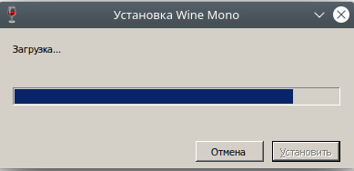
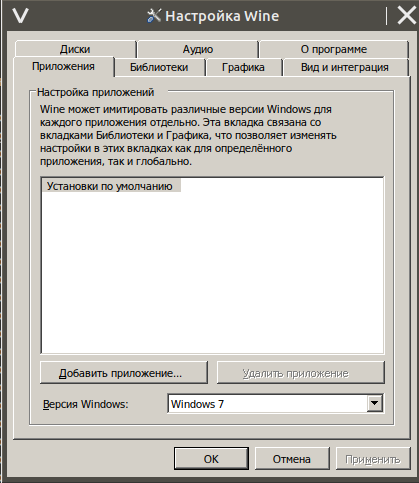

## Установка и настройка Wine в Ubuntu 20.04

### Меняем архитектуру устанавливаемых Windows-приложений:

`sudo dpkg --add-architecture i386 && sudo apt update`

### Скачиваем ключ репозитория и добавляем его в систему:

`wget -nc https://dl.winehq.org/wine-builds/winehq.key && sudo apt-key add winehq.key`

### Добавляем репозиторий:

`sudo add-apt-repository 'deb https://dl.winehq.org/wine-builds/ubuntu/ focal main' && sudo apt update`

### Устанавливаем сам Wine:

`sudo apt install --install-recommends -y winehq-devel winetricks winbind cabextract ; rm -R ~/.wine && env WINEPREFIX=~/.wine WINEARCH=win32 winecfg`

### Проверить версию Wine:

`wine --version`

### Прокачиваем Wine:

`winetricks --force -q d3dcompiler_47 ; winetricks d3dx9_36 ; winetricks --force -q vcrun2015 ; winetricks --force -q corefonts ; winetricks --force -q dotnet45 ; winetricks --force -q msxml6 ; winetricks --force -q dotnet472`

*следуем инструкциям, которые будут показаны на экране (это может долго выполняться!)*

### Запускаем конфигуратор Wine и выбираем в нём Windows 7 или 10

`winecfg`

### Перезагрузите компьютер! После перезагрузки можете обычным образом устанавливать и запускать Windows приложения.

